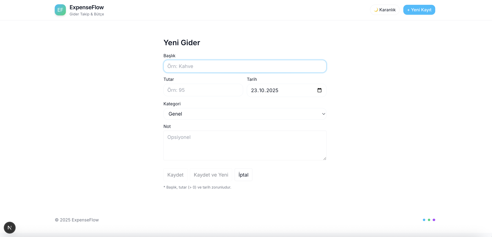
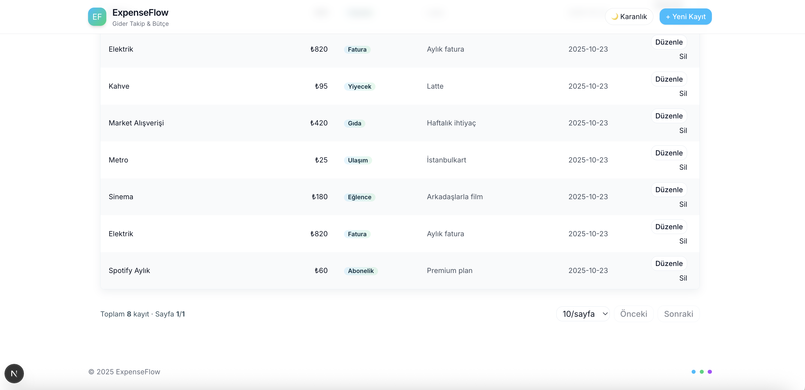
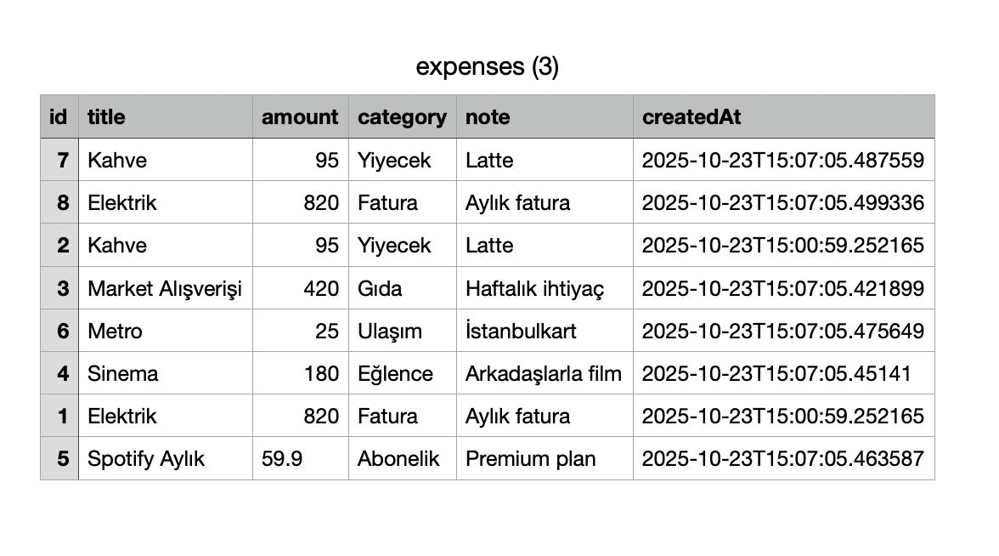

# 💰 ExpenseFlow


**ExpenseFlow**, kişisel gider takibini kolaylaştırmak için geliştirdiğim modern bir **gider & bütçe yönetim uygulaması**dır.  
Tamamen full-stack bir yapıda ilerliyorum: **Spring Boot (Java 21)** tabanlı backend ve **Next.js 16 + Tailwind CSS** frontend birlikte çalışıyor.  
Proje hâlâ **aktif geliştirme aşamasında** ve yeni özellikler eklemeye devam ediyorum. 🚀  

---

## 🎯 Amaç

Günlük giderleri kayıt altına alabileceğim, kategori bazlı istatistikleri görebileceğim ve harcama alışkanlıklarımı PDF veya CSV olarak dışa aktarabileceğim tek bir sade platform oluşturmak istedim.  
Zamanla çok kullanıcılı bir yapıya, gelir takibine ve aylık bütçe hedeflerine doğru genişleteceğim.

---

## 🧱 Teknoloji Yığını

| Katman | Teknoloji |
|--------|------------|
| **Backend** | Java 21, Spring Boot 3.3.x, Spring Data JPA, H2 / SQLite |
| **Frontend** | Next.js 16 (App Router), React 19, TypeScript, Tailwind CSS v3 |
| **PDF / Raporlama** | pdf-lib (Türkçe karakter destekli font gömme) |
| **Grafikler** | Recharts |
| **Veritabanı** | SQLite (geliştirme) → planlı geçiş: Neon / PostgreSQL |
| **Auth** | Basic Auth (admin: 123456) – ileride JWT |

---

## 🧭 Genel Özellikler

- 💸 **Gider ekleme, düzenleme, silme**  
- 🗂️ **Kategoriye göre gruplama** (ör: Gıda, Ulaşım, Fatura, Eğlence…)  
- 📅 **Tarih filtreleme** – “Bu Ay”, “Son 30 Gün”, özel aralık  
- 📊 **Kategorilere göre grafikler** (Recharts)  
- 🧾 **PDF ve CSV dışa aktar**  
- 🌗 **Aydınlık / Karanlık tema geçişi** (kalıcı, localStorage tabanlı)  
- 💬 Türkçe arayüz ve ₺ para birimi desteği  

---

## 🖼️ Ekran Görüntüleri

| Sayfa | Görsel |
|-------|--------|
| **1️⃣ Gider Listesi** |  |
| **2️⃣ Yeni Gider** |  |
| **3️⃣ Özet Rapor** |  |
| **4️⃣ PDF Test (backend)** |  |

---

## ⚙️ Kurulum

### 1️⃣ Backend (Spring Boot)
```bash
cd expenseflow
mvn clean package -DskipTests
java -jar target/expenseflow-0.0.2-SNAPSHOT.jar
````

> Backend varsayılan olarak `http://localhost:8080` üzerinde çalışır.
> Giriş bilgileri: **admin / 123456**

### 2️⃣ Frontend (Next.js)

```bash
cd expenseflow-ui
npm install
npm run dev
```

> Arayüz: [http://localhost:3000](http://localhost:3000)

`.env.local` içeriği:

```bash
BACKEND_URL=http://localhost:8080
BASIC_USER=admin
BASIC_PASS=123456
NEXT_PUBLIC_DEFAULT_USER_ID=1
```

---

## 📈 Yol Haritası

* [x] CRUD işlemleri
* [x] Filtreleme ve istatistik grafikleri
* [x] PDF/CSV export
* [x] Tema geçişi (light/dark)
* [ ] Kullanıcı girişi (JWT)
* [ ] Aylık bütçe hedefi belirleme
* [ ] Çoklu kullanıcı / ekip desteği
* [ ] Gelir tablosu entegrasyonu
* [ ] Mobil PWA sürümü

---

## 👩‍💻 Geliştirici

**Açelya Ünal**

> Yazılım Mühendisi · Full-Stack Developer
> [GitHub](https://github.com/acelyaunal) · [LinkedIn](https://www.linkedin.com/in/acelyaunal)

---

## 🧠 Not

Bu proje hâlen geliştirme aşamasında.
Tasarım, performans ve kullanıcı deneyimi tarafında sürekli iyileştirmeler yapıyorum.
Yeni özellikleri test etmek istersen issue veya pull request açabilirsin. 💬

```

